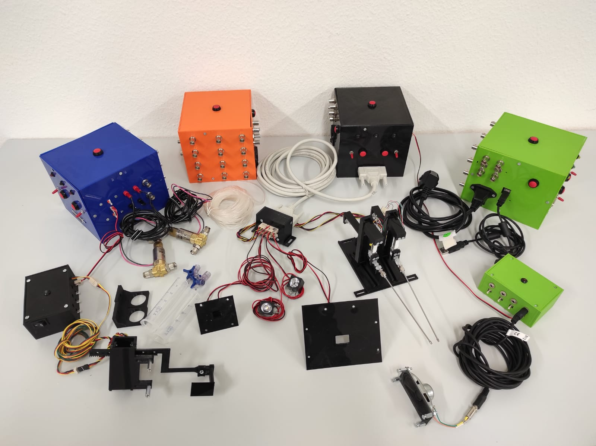
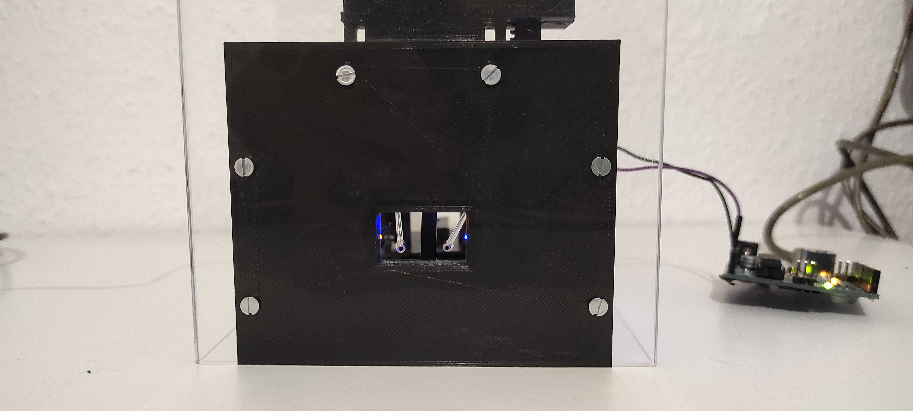

# FreiBox
Open-ressource for building FreiBox and its modules (including FreiBox Active Commutator).
It contains codes, references tables for electronic components, 3D stl files and pictures.

Contact:
Brice De La Crompe,
brice . de . la . crompe /at/ biologie . uni-freiburg . de,
Optophysiology Lab (Ilka Diester's lab),
Freiburg, Germany

For specific question regarding the GUI, please contact:
megan . j . schneck /at/ gmail . com

___________________
Component Overview
___________________

___________________
Licking Chamber
___________________

